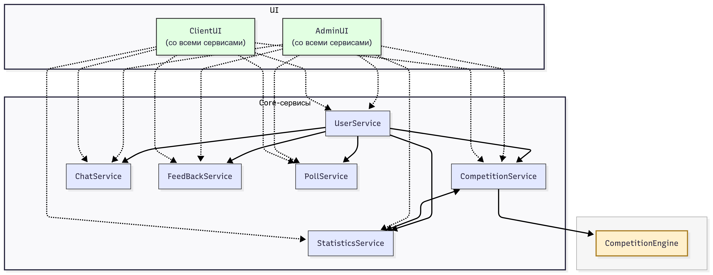

\```mermaid
  flowchart TD
    %% Верхний уровень: CompetitionEngine отдельно
    subgraph L1 [" "]
    style L1 fill:#f6f6f6,stroke:#aaa,stroke-width:1px
    CompetitionEngine["CompetitionEngine"]
    end

    %% Средний уровень: Core-сервисы
    subgraph Core ["Core-сервисы"]
    direction LR
    UserService["UserService"]
    CompetitionService["CompetitionService"]
    StatisticsService["StatisticsService"]
    ChatService["ChatService"]
    FeedBackService["FeedBackService"]
    PollService["PollService"]
    end

    %% Нижний уровень: UI
    subgraph UI ["UI"]
    direction LR
    AdminUI["AdminUI<br/>(со всеми сервисами)"]
    ClientUI["ClientUI<br/>(со всеми сервисами)"]
    end

    %% Взаимосвязи в Core
    UserService --> CompetitionService
    UserService --> StatisticsService
    UserService --> ChatService
    UserService --> FeedBackService
    UserService --> PollService

    CompetitionService <--> StatisticsService
    CompetitionService --> CompetitionEngine

    %% UI связи только с Core-сервисами
    AdminUI -.-> UserService
    AdminUI -.-> CompetitionService
    AdminUI -.-> StatisticsService
    AdminUI -.-> ChatService
    AdminUI -.-> FeedBackService
    AdminUI -.-> PollService

    ClientUI -.-> UserService
    ClientUI -.-> CompetitionService
    ClientUI -.-> StatisticsService
    ClientUI -.-> ChatService
    ClientUI -.-> FeedBackService
    ClientUI -.-> PollService

    %% Стили для разных частей
    classDef ui fill:#e2ffe2,stroke:#333,stroke-width:1.5px
    classDef core fill:#e3e8ff,stroke:#333,stroke-width:1px
    classDef engine fill:#fff0cc,stroke:#a97d22,stroke-width:2px

    class AdminUI,ClientUI ui
    class UserService,CompetitionService,StatisticsService,ChatService,FeedBackService,PollService core
    class CompetitionEngine engine

\```
